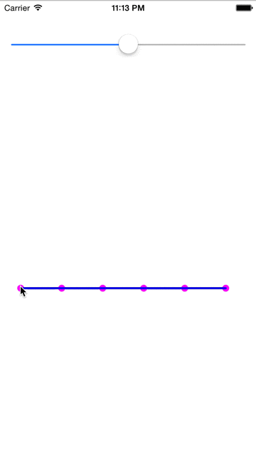

# LxThroughPointsBezier
    Draw a smooth bezier through several points you designated. The curve‘s bend level is adjustable.
Installation
------------
    You only need drag UIBezierPath+LxThroughPointsBezier.h and UIBezierPath+LxThroughPointsBezier.m to your project.

Podfile
------------
    pod 'LxThroughPointsBezier', '~> 1.0.0'

Support
------------
    Minimum support iOS version: iOS 5.0
How to use
-----------
```objc
    #import "UIBezierPath+LxThroughPointsBezier.h"

    CGPoint point1 = CGPointMake(30, 180);
    CGPoint point2 = CGPointMake(90, 120);
    CGPoint point3 = CGPointMake(120, 200);
    CGPoint point4 = CGPointMake(160, 240);
    CGPoint point5 = CGPointMake(210, 160);
    CGPoint point6 = CGPointMake(240, 300);
    CGPoint point7 = CGPointMake(290, 140);
    
    NSValue * point1Value = [NSValue valueWithCGPoint:point1];
    NSValue * point2Value = [NSValue valueWithCGPoint:point2];
    NSValue * point3Value = [NSValue valueWithCGPoint:point3];
    NSValue * point4Value = [NSValue valueWithCGPoint:point4];
    NSValue * point5Value = [NSValue valueWithCGPoint:point5];
    NSValue * point6Value = [NSValue valueWithCGPoint:point6];
    NSValue * point7Value = [NSValue valueWithCGPoint:point7];
    
    _pointArray = [NSMutableArray array];
    [_pointArray addObjectsFromArray:@[point1Value, point2Value, point3Value, point4Value, point5Value, point6Value, point7Value]];
    
    _curve = [UIBezierPath bezierPath];
    _curve.contractionFactor = 0.6;
    [_curve moveToPoint:point1];
    [_curve addBezierThroughPoints:_pointArray];
    
    _shapeLayer = [CAShapeLayer layer];
    _shapeLayer.strokeColor = [UIColor blueColor].CGColor;
    _shapeLayer.fillColor = nil;
    _shapeLayer.lineWidth = 3;
    _shapeLayer.path = _curve.CGPath;
    [_view.layer addSublayer:_shapeLayer];
```
Effect
-----------
*	

Be careful            
-----------
    The good bend level is about 0.6 ~ 0.8. The default and recommended value is 0.7.
    You must wrap CGPoint struct to NSValue object, and give at least 1 point for drawing the curve.
License
-----------
    LxThroughPointsBezier is available under the Apache License 2.0. See the LICENSE file for more info.
